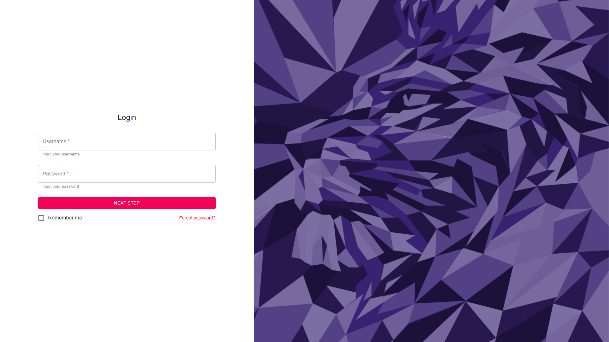

# MChat

[Instant messaging] showcase using typescript && react && material-ui

## QuickStart

### Development

```bash
$ npm i
$ npm run start
$ open http://localhost:3000/
```

### Deploy

```bash
$ npm run build
```

### Npm Scripts

- Use `npm run start` to start project
- Use `npm run test` to run unit test
- se `npm run build` to build your project

### Requirement

- Node.js 8.x
- Typescript 2.8+


### Example
+ Login
